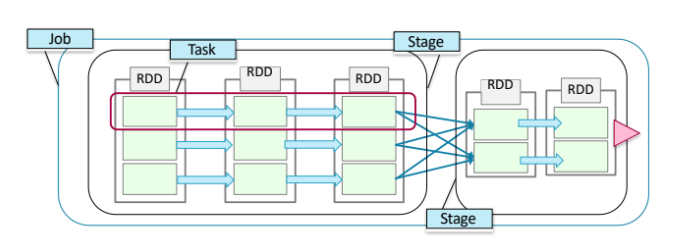

## Apache Spark

빅데이터 프로세싱 엔진으로써 아래와 같은 특징이 있다.

1. Written in Scale
: Functional programming language that runs in a JVM
2. Spark shell
3. Spark Applications


모든 Spark Application은 Spark Context를 필요로 한다. Spark Context는 spark core api의 메인 진입점이다.


### RDD

RDD: Resilient Distributed Dataset </br>
스파크의 가장 근본적인 데이터 단위

- Resilient: if data in memory is lost, it can be recreated.
- Distributed: Processed accross the cluster.
- Dataset: Initial data can come from a source such as a file, or it can be created programmatically.


#### Creating an RDD

- From a file
- From a datain memory
- From another RDD

#### RDD operations: Actions

Actions return values. </br>
Laze Execution: RDD의 데이터들은 Action이 실행되기 전까지 처리되지 않는다.

- count(): returns the number of elements
- take(n): returns an array of the first n elements
- collect(): returns an array of all elements
- saveAsTextFile(dir): saves to text file(s)

#### RDD operations: Transformation

Transformations define a new RDD based on the currentone(s).

- map(function): creates a new RDD by perfoming a function on each record.
- filter(function):  creates a new RDD by incluing or excluding each record in the base RDD according to a Boolean function.

RDD는 immutable 하다.


#### RDD Lineage

스파크는 RDD의 계보(처리 이력)을 유지한다. </br>
toDebugString 함수를 통해 계보를 볼 수 있다.

</br>
</br>

### Parallel Operations

- RDD operations are executed in parallel on each partition
- Some operations preserve patitioning
  - map, flatMap, filter
- Some operations repatition
  - reduceByKey, sortByKey, join, groupByKey

#### Spark Terminology

- Job : a set of task executed as a result of an action
- Stage : a set of tasks in a job that can be executed in parellel
- Task : an individual unit of work sent to one executer
- Application : the set of jobs managed by a single driver




</br>
</br>

### Lab 1. Explorer RDDs Using the Spark Shell

```python

# Set the log level to WARN to reduce distracting INFO messages
sc.setLogLevel("WARN")

# Step 1 - Create an RDD based on a subset of weblogs (those ending in digit 2)
logs=sc.textFile("/loudacre/weblogs/*2.log")
# map each request (line) to a pair (userid, 1), then sum the values
userreqs = logs \
   .map(lambda line: line.split()) \
   .map(lambda words: (words[2],1))  \
   .reduceByKey(lambda count1,count2: count1 + count2)
   
# Step 2 - Show the count frequencies
freqcount = userreqs.map(lambda (userid,freq): (freq,userid)).countByKey()
print freqcount

# Step 3 - Group IPs by user ID
userips = logs \
   .map(lambda line: line.split()) \
   .map(lambda words: (words[2],words[0])) \
   .groupByKey()
# print out the first 10 user ids, and their IP list
for (userid,ips) in userips.take(10):
   print userid, ":"
   for ip in ips: print "\t",ip

# Step 4a - Map account data to (userid,[values....])
accountsdata = "/loudacre/accounts"
accounts = sc.textFile(accountsdata) \
   .map(lambda s: s.split(',')) \
   .map(lambda account: (account[0],account))

# Step 4b - Join account data with userreqs then merge hit count into valuelist   
accounthits = accounts.join(userreqs)

# Step 4c - Display userid, hit count, first name, last name for the first 5 elements
for (userid,(values,count)) in accounthits.take(5) : 
    print  userid, count, values[3],values[4]
   
```

#### Lab2. Use Apache Spark SQL for ETL

```Python
webpageDF = sqlContext.read.load("/loudacre/webpage")
webpageDF.printSchema()
webpageDF.show(5)
assocFilesDF = webpageDF.select(webpageDF.web_page_num, webpageDF.associated_files)
aFilesRDD = assocFilesDF.map(lambda row: (row.web_page_num, row.associated_files))
aFilesRDD2 = aFilesRDD.flatMapValues(lambda filestring: filestring.split(','))
aFileDF = sqlContext.createDataFrame(aFilesRDD2, assocFilesDF.schema)
aFileDF.printSchema()
aFileDF.show(5)
finalDF = aFileDF.withColumnRenamed('associated_files', 'associated_file')
finalDF.show(5)
finalDF.write.mode("overwrite").save("/loudacre/webpage_files")
```