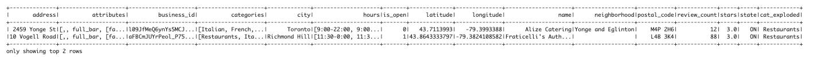
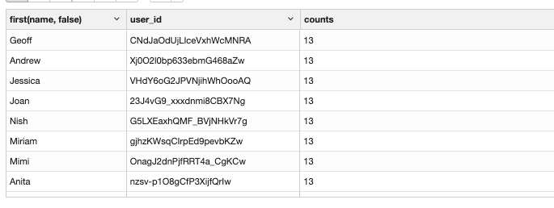

## Exploring the Yelp dataset

Yelp Dataset을 통해 데이터 분석을 실시해본다.

#### 사전 준비
   1. hdfs
   1. yarn
   1. Spark
   1. Hue 


#### 원본 데이터
1. business.json
1. checkin.json
1. photos.json
1. review.json
1. tip.json
1. user.json

#### 데이터 적재

HDFS 업로드
```
hdfs dfs -mkdir /user/hdfs/yelp/business
hdfs dfs -mkdir /user/hdfs/yelp/checkin
hdfs dfs -mkdir /user/hdfs/yelp/photos
hdfs dfs -mkdir /user/hdfs/yelp/review
hdfs dfs -mkdir /user/hdfs/yelp/tip
hdfs dfs -mkdir /user/hdfs/yelp/user

hdfs dfs -put ./business.json /user/hdfs/yelp/business/
hdfs dfs -put ./checkin.json /user/hdfs/yelp/checkin/
hdfs dfs -put ./photos.json /user/hdfs/yelp/photos/
hdfs dfs -put ./review.json /user/hdfs/yelp/review/
hdfs dfs -put ./tip.json /user/hdfs/yelp/tip/
hdfs dfs -put ./user.json /user/hdfs/yelp/user/

```


#### 데이터 확인
```python
%pyspark
bizDF = spark.read.json("/user/hdfs/yelp/business/business.json")
checkinDF = spark.read.json("/user/hdfs/yelp/checkin/checkin.json")
photosDF = spark.read.json("/user/hdfs/yelp/photos/photos.json")
reviewDF = spark.read.json("/user/hdfs/yelp/review/review.json")
tipDF = spark.read.json("/user/hdfs/yelp/tip/tip.json")
userDF = spark.read.json("/user/hdfs/yelp/user/user.json")


bizDF.createOrReplaceTempView("business_df")
checkinDF.createOrReplaceTempView("checkin_df")
photosDF.createOrReplaceTempView("photos_df")
reviewDF.createOrReplaceTempView("review_df")
tipDF.createOrReplaceTempView("tips_df")
userDF.createOrReplaceTempView("user_df")

spark.sql("show tables").show()
```
```sql
+--------+-----------+-----------+
|database|  tableName|isTemporary|
+--------+-----------+-----------+
|        |business_df|       true|
|        | checkin_df|       true|
|        |  photos_df|       true|
|        |  review_df|       true|
|        |    tips_df|       true|
|        |    user_df|       true|
+--------+-----------+-----------+
```

#### 데이터를 hive 테이블로 저장

```python
bizDF.write.option("path", "/user/hdfs/yelp/biz_spark").saveAsTable("myBiz")
checkinDF.write.option("path", "/user/hdfs/yelp/checkin_spark").saveAsTable("myCheckin")
photosDF.write.option("path", "/user/hdfs/yelp/photos_spark").saveAsTable("myPhotos")
reviewDF.write.option("path", "/user/hdfs/yelp/review_spark").saveAsTable("myReview")
tipDF.write.option("path", "/user/hdfs/yelp/tip_spark").saveAsTable("myTip")
```

#### 원본 데이터로부터 데이터 생성

business 테이블에서 categories가 'Restaurant'인 값만 추출하고자 한다.
categories 칼럼이 Array 형태이기때문에 LATERAL VIEW explode를 사용하여 데이터를 펼친다.

```sql
explodedDF = spark.sql(" SELECT * FROM business_df LATERAL VIEW explode(categories) c AS cat_exploded ")
explodedDF.show()
explodedDF.createOrReplaceTempView("exploded_df")
```

펼친 데이터를 검증해본다.
```sql
select sum(size(categories)) from business_df
```
|sum(size(categories)|
|-:|
|667527|
```sql
select * from exploded_df
```
|count(1)|
|-:|
|667527|


펼친 데이터(exploded_df)에서 cat_exploded 값이 'Restaurant'인 값을 restaurants_df로 추출한다.

```python
restaurantsDF = spark. \
sql("SELECT * FROM exploded_df WHERE cat_exploded='Restaurants'")
restaurantsDF.show()
restaurantsDF.createOrReplaceTempView("restaurants_df")
```
```sql
select count(*) from restaurants_df  
```
|count(1)|
|-:|
|54618|


#### 데이터 상세 조회하기
Restaurant 데이터에 조건을 추가하여 조회한다.

```python
spark.sql("""
 SELECT name, state, city, attributes.ambience.romantic romantic
 FROM restaurants_df
 WHERE attributes.ambience.romantic = true LIMIT 10""") \
.show(2)
```
```sql
+--------------------+-----+-------------+--------+
|                name|state|         city|romantic|
+--------------------+-----+-------------+--------+
|      Alize Catering|   ON|      Toronto|    true|
|Fraticelli's Auth...|   ON|Richmond Hill|    true|
+--------------------+-----+-------------+--------+
only showing top 2 rows
```

Pyspark의 메소드를 사용하여 동일한 결과를 확인해본다.

```python
from pyspark.sql import functions as F
romantic=restaurantsDF.filter("attributes.ambience.romantic == true")
romantic.show(2)
restaurantsDF.select(restaurantsDF.name, restaurantsDF.state, restaurantsDF.city, restaurantsDF.attributes.ambience.romantic, F.when(restaurantsDF.attributes.ambience.romantic == "true","true")).show()
```



#### 데이터 조인

Restaurants 테이블과 review 테이블을 조인하여 레스토랑의 리뷰 정보를 조회한다.

```python
revRestDF = reviewDF.join(restaurantsDF, \
 reviewDF.business_id == restaurantsDF.business_id) \
 .select(restaurantsDF.business_id, reviewDF.stars, reviewDF.user_id)
revRestDF.show(2)
revRestDF.createOrReplaceTempView("revRest_df")
```
```sql
+--------------------+-----+-------------+--------+
|                name|state|         city|romantic|
+--------------------+-----+-------------+--------+
|      Alize Catering|   ON|      Toronto|    true|
|Fraticelli's Auth...|   ON|Richmond Hill|    true|
+--------------------+-----+-------------+--------+
only showing top 2 rows
```

조인된 테이블을 평점별로 그루핑을 한다.
```sql
select stars, count(stars) from revRest_df group by stars
```
|stars|count(stars)|
|-|-:|
|1|362143|
|2|310257|
|3|451004|
|4|883531|
|5|1214484|

#### 데이터 시각화 

유저들은 연도별로 '엘리트' 유저로 선정되며 이는 유저 데이터에서 elite 칼럼에 Array형태로 저장되어 있다. elite 칼럼을 확장하여 유저별로 elite로 선정된 연도 수를 구한다.

```python
%pyspark
from pyspark.sql.functions import explode
eliteDF = userDF.withColumn("elite_year", explode(userDF.elite))
eliteDF.show(6)
eliteDF.createOrReplaceTempView("elite_df")
```


```sql
%sql
select first(name), user_id, count(elite_year) as counts from elite_df group by user_id order by counts desc
```



