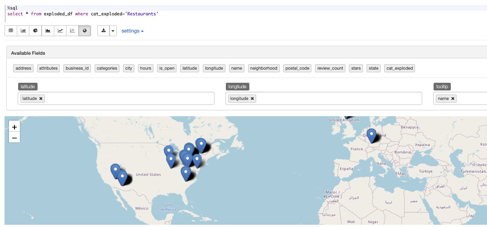
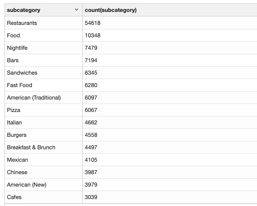
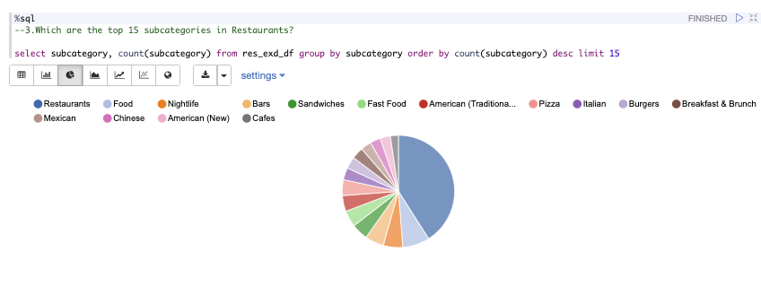
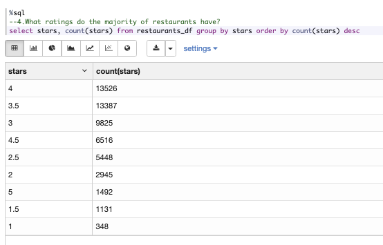
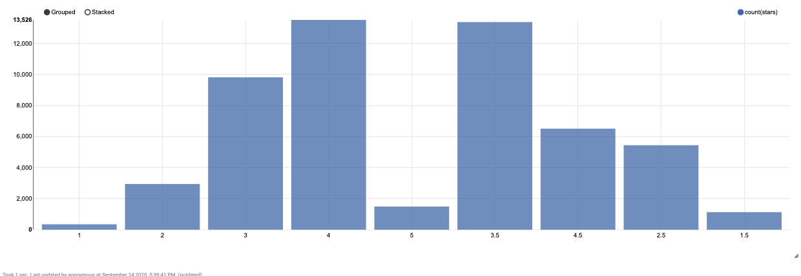
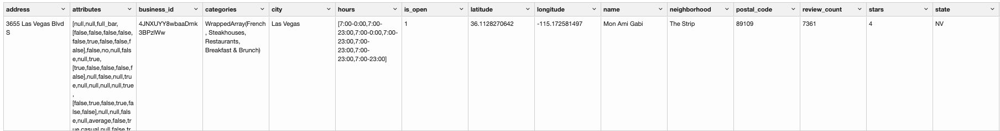

# Query Visualization

## 1. Map of restaurants across the United States
### : zeppline-leaflet 플러그인을 사용하여 맵을 표현함.
</br>

### 결과


</br>

## 2. Which cities have the highest number of restaurants?
### : 레스토랑 데이터에서 city를 기준으로 그룹핑하여 결과를 출력함.
</br>

### 코드
```python
%pyspark
import pyspark.sql.functions as func
restGroupByCityDF = restaurantsDF.groupBy('city').agg(func.count('name').alias('count')).sort(func.desc('count')).limit(1).show()
```

### 결과
```sql
+-----------+-----+
|       city|count|
+-----------+-----+
|    Toronto| 7148|
+-----------+-----+

```
</br>

## 3. Which are the top 15 subcategories in Restaurants?
### : 레스토랑과 같은 카테고리로 포함된 카테고리를 서브 카테고리로 정의하였음. 레스토랑 데이터의 categories 배열 subcategory로 확장하였고 subcategory를 기준으로 그룹핑하여 결과를 출력함.
</br>

### 1차 코드
: 레스토랑 데이터에서 categories 칼럼을 subcategory로 확장한 후 res_exd_df로 명명
```python
resExDF = spark.sql(" SELECT * FROM restaurants_df LATERAL VIEW explode(categories) c AS subcategory ")
resExDF.show()
resExDF.createOrReplaceTempView("res_exd_df")

```

### 1차 결과
```sql
+----------------+--------------------+--------------------+--------------------+--------------+--------------------+-------+-------------+--------------+--------------------+------------------+-----------+------------+-----+-----+------------+--------------------+
|         address|          attributes|         business_id|          categories|          city|               hours|is_open|     latitude|     longitude|                name|      neighborhood|postal_code|review_count|stars|state|cat_exploded|         subcategory|
+----------------+--------------------+--------------------+--------------------+--------------+--------------------+-------+-------------+--------------+--------------------+------------------+-----------+------------+-----+-----+------------+--------------------+
|    581 Howe Ave|[,, full_bar, [tr...|PfOCPjBrlQAnz__NX...|[American (New), ...|Cuyahoga Falls|[11:00-1:00, 11:0...|      1|   41.1195346|   -81.4756898|Brick House Taver...|                  |      44221|         116|  3.5|   OH| Restaurants|      American (New)|
|    581 Howe Ave|[,, full_bar, [tr...|PfOCPjBrlQAnz__NX...|[American (New), ...|Cuyahoga Falls|[11:00-1:00, 11:0...|      1|   41.1195346|   -81.4756898|Brick House Taver...|                  |      44221|         116|  3.5|   OH| Restaurants|           Nightlife|
|    581 Howe Ave|[,, full_bar, [tr...|PfOCPjBrlQAnz__NX...|[American (New), ...|Cuyahoga Falls|[11:00-1:00, 11:0...|      1|   41.1195346|   -81.4756898|Brick House Taver...|                  |      44221|         116|  3.5|   OH| Restaurants|                Bars|
|    581 Howe Ave|[,, full_bar, [tr...|PfOCPjBrlQAnz__NX...|[American (New), ...|Cuyahoga Falls|[11:00-1:00, 11:0...|      1|   41.1195346|   -81.4756898|Brick House Taver...|                  |      44221|         116|  3.5|   OH| Restaurants|          Sandwiches|
|    581 Howe Ave|[,, full_bar, [tr...|PfOCPjBrlQAnz__NX...|[American (New), ...|Cuyahoga Falls|[11:00-1:00, 11:0...|      1|   41.1195346|   -81.4756898|Brick House Taver...|                  |      44221|         116|  3.5|   OH| Restaurants|American (Traditi...|
|    581 Howe Ave|[,, full_bar, [tr...|PfOCPjBrlQAnz__NX...|[American (New), ...|Cuyahoga Falls|[11:00-1:00, 11:0...|      1|   41.1195346|   -81.4756898|Brick House Taver...|                  |      44221|         116|  3.5|   OH| Restaurants|             Burgers|
|    581 Howe Ave|[,, full_bar, [tr...|PfOCPjBrlQAnz__NX...|[American (New), ...|Cuyahoga Falls|[11:00-1:00, 11:0...|      1|   41.1195346|   -81.4756898|Brick House Taver...|                  |      44221|         116|  3.5|   OH| Restaurants|         Restaurants|
+----------------+--------------------+--------------------+--------------------+--------------+--------------------+-------+-------------+--------------+--------------------+------------------+-----------+------------+-----+-----+------------+--------------------+
```

### 2차 코드
: res_exd_df에서 그룹핑하여 결과 출력
```sql
select subcategory, count(subcategory) from res_exd_df group by subcategory order by count(subcategory) desc limit 15
```
### 2차 결과

### 2차 결과 - 차트


</br>

## 4. What ratings do the majority of restaurants have?
### : 레스토랑 데이터에서 stars 칼럼을 그룹핑하여 결과를 조회함


</br>

### 코드
```sql
select stars, count(stars) from restaurants_df group by stars order by count(stars) desc
```
### 결과

바 차트
### 결과 - 차트



5. What is rating distribution in the restaurant reviews?


6. Which type of restaurants get good reviews? How about bad reviews?


a. This will depend on what you consider a good rating. Above 4 star perhaps? You
choose.

b. Similarly, for bad reviews. What would be considered a bad review?


## 7. Which restaurants have the most reviews?
### : 레스토랑 데이터에서 review_count 칼럼을 기준으로 정렬하여 조회함.

### 코드
```sql
select * from restaurants_df order by review_count desc limit 1
```
### 결과



## 8. What number of yelp users are elite users? Do they rate differently than non-elite users?
### : 유저 데이터에서 elite의 size 값이 0 보다 큰 레코드의 수를 조회함. elite 유저와 non-elite 유저의 특징을 비교하기 위해 유저의 평점, cool, cute, funny, hot, list, photos 칼럼을 비교함.

### 1차 코드
```sql
select count(*) from team3_user where size(elite) > 0
```
### 1차 결과
|count(1)|
|-:|
|60818|

### 2차 코드
: 두 타입의 유저의 평균 star, 평균 compliment, photos 값을 조회하여 비교함.
```python
%pyspark
#8.Do they rate differently than non-elite users?
import pyspark.sql.functions as f
eliteUser = spark.sql("select 'elite' as kind, avg(average_stars) as avg_stars, avg(compliment_cool) as cool, avg(compliment_cute) as cute, avg(compliment_funny) as funny, avg(compliment_hot) as hot, avg(compliment_list) as list, avg(compliment_photos) as photos from team3_user where size(elite) > 0")
normalUser = spark.sql("select 'normal' as kind, avg(average_stars) as avg_stars, avg(compliment_cool) as cool, avg(compliment_cute) as cute, avg(compliment_funny) as funny, avg(compliment_hot) as hot, avg(compliment_list) as list, avg(compliment_photos) as photos from team3_user where size(elite) = 0")

diff = eliteUser.union(normalUser)
diff.show()
diff = diff.select(col("kind"),f.round(col("avg_stars"),2),f.round(col("cool"),2),f.round(col("cute"),2),f.round(col("funny"),2),f.round(col("hot"),2),f.round(col("list"),2),f.round(col("photos"),2))
diff.show()
```
### 2차 결과
: 평균 평점은 비슷하나 평균 compliment 값, photos 값에서 차이가 나는 것을 볼 수 있음.
```sql
+------+------------------+-------------------+-------------------+-------------------+------------------+-------------------+-------------------+
|  kind|         avg_stars|               cool|               cute|              funny|               hot|               list|             photos|
+------+------------------+-------------------+-------------------+-------------------+------------------+-------------------+-------------------+
| elite|3.8472539379788855|  67.90520898418231| 4.1536387253773555|  67.90520898418231| 49.62206912427242| 1.8243940938537933|  22.14984050774442|
|normal| 3.704284503941084|0.41273533272793517|0.04151877485115978|0.41273533272793517|0.2709536127490846|0.01812400862099625|0.17998345034272964|
+------+------------------+-------------------+-------------------+-------------------+------------------+-------------------+-------------------+

+------+-------------------+--------------+--------------+---------------+-------------+--------------+----------------+
|  kind|round(avg_stars, 2)|round(cool, 2)|round(cute, 2)|round(funny, 2)|round(hot, 2)|round(list, 2)|round(photos, 2)|
+------+-------------------+--------------+--------------+---------------+-------------+--------------+----------------+
| elite|               3.85|         67.91|          4.15|          67.91|        49.62|          1.82|           22.15|
|normal|                3.7|          0.41|          0.04|           0.41|         0.27|          0.02|            0.18|
+------+-------------------+--------------+--------------+---------------+-------------+--------------+----------------+
```
