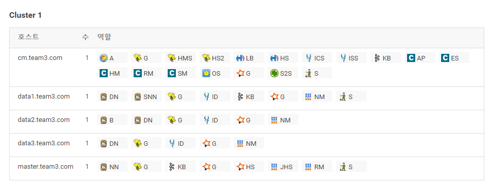
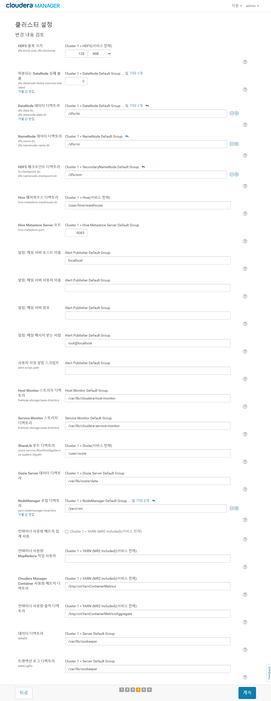
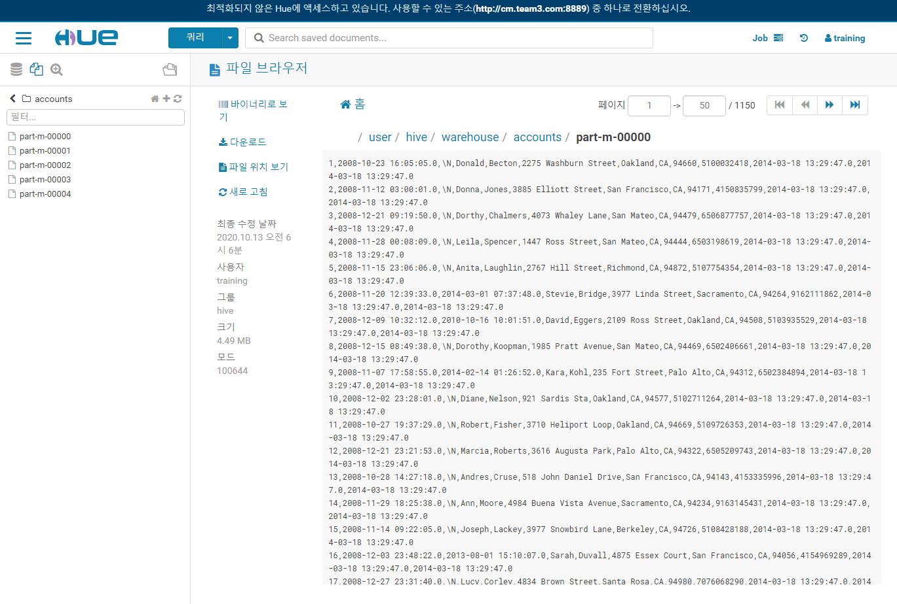

# Installing Cloudera Manager, CDH and Managed Services

## 서버 설계

### CDH 정보

### 서버 스펙

- 서버 수 : 5 대
- os : Centos Linux 7

### 서버 구성

- CM 서버 1
  - CM 설치
  - Maria DB 서버 설치
- Master 서버 1
- Data 서버 3
- 최종 서버 구성



## 사전 설정 

### /etc/hosts 설정

모든 노드에 host를 설정한다.

```sh
vi /etc/hosts

10.0.0.154 cm.3team.com  cm
10.0.0.158 master.3team.com  master
10.0.0.61 data1.3team.com  data1
10.0.0.190 data2.3team.com  data2
10.0.0.191 data3.3team.com  data3

```


host 변경 및 확인

```sh
sudo hostnamectl set-hostname cm.3team.com
sudo hostnamectl set-hostname master.3team.com
sudo hostnamectl set-hostname data1.3team.com
sudo hostnamectl set-hostname data2.3team.com
sudo hostnamectl set-hostname data3.3team.com
```

```sh
getent hosts 10.0.0.154 10.0.0.158 10.0.0.61 10.0.0.190 10.0.0.191
```


### 디스크 설정 및 확인


```sh
> df -h
Filesystem      Size  Used Avail Use% Mounted on
devtmpfs        7.6G     0  7.6G   0% /dev
tmpfs           7.6G     0  7.6G   0% /dev/shm
tmpfs           7.6G   17M  7.6G   1% /run
tmpfs           7.6G     0  7.6G   0% /sys/fs/cgroup
/dev/nvme0n1p1  100G   14G   87G  14% /
tmpfs           1.6G     0  1.6G   0% /run/user/0
tmpfs           1.6G     0  1.6G   0% /run/user/1000
cm_processes    7.6G   29M  7.6G   1% /run/cloudera-scm-agent/process
tmpfs           1.6G     0  1.6G   0% /run/user/997

```

### vm.swappiness  설정

모든 노드에서 vm.swappiness를 설정한다.

```sh
sudo sysctl vm.swappiness=1
```

### transparent_hugepage disable

모든 노드에서 transparent_hugepage 를 disable 한다.

```sh
sudo vi /etc/rc.d/rc.local

# 아래 내용을 추가한다.
echo "never" > /sys/kernel/mm/transparent_hugepage/enabled
echo "never" > /sys/kernel/mm/transparent_hugepage/defrag


sudo chmod +x /etc/rc.d/rc.local

sudo vi /etc/default/grub

GRUB_CMDLINE_LINUX="console=tty0 crashkernel=auto console=ttyS0,115200, transparent_hugepage=never"


sudo grub2-mkconfig -o /boot/grub2/grub.cfg
sudo systemctl start tuned
sudo tuned-adm off
sudo tuned-adm list
sudo systemctl stop tuned
sudo systemctl disable tuned

shutdown -r now

cat /proc/cmdline

```


### nptd, nscd 설치 및 실행

모든 노드에 nptd, nscd를 설치하고 실행한다.

```sh

yum update

sudo yum install -y ntp

sudo vi /etc/ntp.conf

#server 0.centos.pool.ntp.org iburst
#server 1.centos.pool.ntp.org iburst
#server 2.centos.pool.ntp.org iburst
#server 3.centos.pool.ntp.org iburst
server 0.asia.pool.ntp.org
server 1.asia.pool.ntp.org
server 2.asia.pool.ntp.org
server 3.asia.pool.ntp.org

sudo systemctl start ntpd
sudo systemctl enable ntpd
sudo ntpq -p

sudo yum install -y nscd
sudo systemctl start nscd
sudo systemctl enable nscd

```


### SSH 설정

CM 서버가 나머지 host에 ssh로 접속할 수 있도록 CM 서버에서 sshkey를 생성한 뒤 나머지 노드에 /authorized_keys 를 등록한다.

```sh

ssh-keygen -t rsa

cat ~/.ssh/id_rsa.pub

```

```sh

sudo vi ~/.ssh/authorized_keys

```

ssh 접속을 확인한다.


### JDK 설치

```sh
yum list all | grep java-1.7
sudo yum install -y java-1.7.0-openjdk-devel.x86_64
java -version
```


## Cloudera Manager 설치

### Cloudera Repository 설정

Clouder Manager Server, Agent, Daemon을 설치하기 위해 
yum repository를 설정한다.

```sh
# Repo 정보를 다운받는다.
sudo wget https://archive.cloudera.com/cm5/redhat/7/x86_64/cm/cloudera-manager.repo -P /etc/yum.repos.d/

# baseUrl을 변경하여 5.15.2 버전을 다운받을 수 있도록 한다.
sudo vi /etc/yum.repos.d/cloudera-manager.repo

baseurl=https://archive.cloudera.com/cm5/redhat/7/x86_64/cm/5.15.2/

# GPG Key를 설정한다.
sudo rpm --import https://archive.cloudera.com/cm5/redhat/7/x86_64/cm/RPM-GPG-KEY-cloudera

# yum update 한다.
sudo yum update 

```


### Cloudera Manager Server 설치

CM 서버에서 Cloudera manager, daemons를 설치한다.

```sh
sudo yum install -y cloudera-manager-daemons cloudera-manager-server
```

### Cloudera Agent 설치 및 config 설정

모든 노드에서 Cloudera Agent, daemons를 설치한다.

```sh
sudo yum install -y cloudera-manager-daemons cloudera-manager-agent
```


agent를 설치한 후 /etc/cloudera-scm-agent/config.ini 에서 서버 호스트 정보를 변경한다.

```sh
sudo vi /etc/cloudera-scm-agent/config.ini

# Hostname of the CM server.
server_host=cm

# Port that the CM server is listening on.
server_port=7182

```


Cloudera Agent를 실행한다.

```sh
sudo systemctl start cloudera-scm-agent
```


## 데이터베이스 설치

### Database(MariaDB), JDBC Driver 설치

CM 서버에 Mariadb Server를 설치하고 나머지 노드에는 Mysql Connector를 설치한다.

#### MariaDB 서버 설치

```sh

sudo yum install -y mariadb-server

```


```sh

sudo vi /etc/my.cnf

아래 내용 붙여넣기

[mysqld]
datadir=/var/lib/mysql
socket=/var/lib/mysql/mysql.sock
transaction-isolation = READ-COMMITTED
# Disabling symbolic-links is recommended to prevent assorted security risks;
# to do so, uncomment this line:
symbolic-links = 0
# Settings user and group are ignored when systemd is used.
# If you need to run mysqld under a different user or group,
# customize your systemd unit file for mariadb according to the
# instructions in http://fedoraproject.org/wiki/Systemd

key_buffer = 16M
key_buffer_size = 32M
max_allowed_packet = 32M
thread_stack = 256K
thread_cache_size = 64
query_cache_limit = 8M
query_cache_size = 64M
query_cache_type = 1

max_connections = 550
#expire_logs_days = 10
#max_binlog_size = 100M

#log_bin should be on a disk with enough free space.
#Replace '/var/lib/mysql/mysql_binary_log' with an appropriate path for your
#system and chown the specified folder to the mysql user.
log_bin=/var/lib/mysql/mysql_binary_log

#In later versions of MariaDB, if you enable the binary log and do not set
#a server_id, MariaDB will not start. The server_id must be unique within
#the replicating group.
server_id=1

binlog_format = mixed

read_buffer_size = 2M
read_rnd_buffer_size = 16M
sort_buffer_size = 8M
join_buffer_size = 8M

# InnoDB settings
innodb_file_per_table = 1
innodb_flush_log_at_trx_commit  = 2
innodb_log_buffer_size = 64M
innodb_buffer_pool_size = 4G
innodb_thread_concurrency = 8
innodb_flush_method = O_DIRECT
innodb_log_file_size = 512M

[mysqld_safe]
log-error=/var/log/mariadb/mariadb.log
pid-file=/var/run/mariadb/mariadb.pid

#
# include all files from the config directory
#
!includedir /etc/my.cnf.d

sudo systemctl enable mariadb

sudo systemctl start mariadb

sudo /usr/bin/mysql_secure_installation

user: root
password: team03


[centos@ip-10-0-0-47 ~]$ sudo /usr/bin/mysql_secure_installation

NOTE: RUNNING ALL PARTS OF THIS SCRIPT IS RECOMMENDED FOR ALL MariaDB
      SERVERS IN PRODUCTION USE!  PLEASE READ EACH STEP CAREFULLY!

In order to log into MariaDB to secure it, we will need the current
password for the root user.  If you have just installed MariaDB, and
you have nott set the root password yet, the password will be blank,
so you should just press enter here.

Enter current password for root (enter for none):
OK, successfully used password, moving on...

Setting the root password ensures that nobody can log into the MariaDB
root user without the proper authorisation.

Set root password? [Y/n] y
New password:
Re-enter new password:
Sorry, you can not use an empty password here.

New password:
Re-enter new password:
Password updated successfully!
Reloading privilege tables..
 ... Success!


By default, a MariaDB installation has an anonymous user, allowing anyone
to log into MariaDB without having to have a user account created for
them.  This is intended only for testing, and to make the installation
go a bit smoother.  You should remove them before moving into a
production environment.

Remove anonymous users? [Y/n] y
 ... Success!

Normally, root should only be allowed to connect from 'localhost'.  This
ensures that someone cannot guess at the root password from the network.

Disallow root login remotely? [Y/n] n
 ... skipping.

By default, MariaDB comes with a database named 'test' that anyone can
access.  This is also intended only for testing, and should be removed
before moving into a production environment.

Remove test database and access to it? [Y/n] y
 - Dropping test database...
 ... Success!
 - Removing privileges on test database...
 ... Success!

Reloading the privilege tables will ensure that all changes made so far
will take effect immediately.

Reload privilege tables now? [Y/n] y
 ... Success!

Cleaning up...

All done!  If you have completed all of the above steps, your MariaDB
installation should now be secure.

Thanks for using MariaDB!

```


#### Database, User, 권한 생성

```sql

CREATE DATABASE scm DEFAULT CHARACTER SET  utf8  DEFAULT COLLATE utf8_general_ci;
CREATE DATABASE amon DEFAULT CHARACTER SET utf8 DEFAULT COLLATE utf8_general_ci;
CREATE DATABASE rman DEFAULT CHARACTER SET utf8 DEFAULT COLLATE utf8_general_ci;
CREATE DATABASE hue DEFAULT CHARACTER SET utf8 DEFAULT COLLATE utf8_general_ci;
CREATE DATABASE metastore DEFAULT CHARACTER SET utf8 DEFAULT COLLATE utf8_general_ci;
CREATE DATABASE sentry DEFAULT CHARACTER SET utf8 DEFAULT COLLATE utf8_general_ci;
CREATE DATABASE nav DEFAULT CHARACTER SET utf8 DEFAULT COLLATE utf8_general_ci;
CREATE DATABASE navms DEFAULT CHARACTER SET utf8 DEFAULT COLLATE utf8_general_ci;
CREATE DATABASE oozie DEFAULT CHARACTER SET utf8 DEFAULT COLLATE utf8_general_ci;


GRANT ALL ON scm.* TO 'scm'@'%' IDENTIFIED BY 'scm';
GRANT ALL ON amon.* TO 'amon'@'%' IDENTIFIED BY 'amon';
GRANT ALL ON rman.* TO 'rman'@'%' IDENTIFIED BY 'rman';
GRANT ALL ON hue.* TO 'hue'@'%' IDENTIFIED BY 'hue';
GRANT ALL ON metastore.* TO 'metastore'@'%' IDENTIFIED BY 'metastore';
GRANT ALL ON sentry.* TO 'sentry'@'%' IDENTIFIED BY 'sentry';
GRANT ALL ON nav.* TO 'nav'@'%' IDENTIFIED BY 'nav';
GRANT ALL ON navms.* TO 'navms'@'%' IDENTIFIED BY 'navms';
GRANT ALL ON oozie.* TO 'oozie'@'%' IDENTIFIED BY 'oozie';

```

#### JDBC 드라이버 설치

모든 노드에 jdbc driver와 mysql을 설치한다.

```sh

sudo yum install -y mysql

```

```sh

wget https://dev.mysql.com/get/Downloads/Connector-J/mysql-connector-java-5.1.49.tar.gz

tar zxvf mysql-connector-java-5.1.49.tar.gz

sudo mkdir -p /usr/share/java/

cd mysql-connector-java-5.1.49

sudo cp mysql-connector-java-5.1.49.jar /usr/share/java/mysql-connector-java.jar

```

mysql로 Database에 접속해본다.

```sh

mysql -h cm -u scm -p

```

#### 데이터베이스 Shell 실행

```sh
sudo /usr/share/cmf/schema/scm_prepare_database.sh mysql scm scm
```

## Clouder Manager 서버 실행

### Cloudera Manager 서버 실행

CM 서버에서 cloudera-scm-server를 실행한다.

```sh
sudo systemctl start cloudera-scm-server
```

### Cloudera Manager Admin Console 접속

웹 브라우져로 Cloudera Manager Console에 접속한다.


CM 클러스터를 설치할 호스트를 설정한다.

(아래 그림과 다르게 cm에도 설치가 필요함.)


리포지토리를 설정한다.


클러스터를 설치한다.


### 클러스터 설치

웹 브라우저에서 하둡 클러스터를 설치한다.





### Flume, Hive, Impala 설치

웹 브라우저에서 Flume, Hive, Impala를 설치한다.


### Sqoop, Spark, Kafka 설치

Sqoop, Spark를 설치한다.


kafka를 설치하기 위해 parcel 설정을 변경한다.


kafka를 설치한다.


완료된 상태


### training 유저 세팅

각 노드에 training 유저를 생성한다.

```sh
sudo adduser -m training

sudo passwd training

sudo visudo

# 아래 내용을 추가한다.
training        ALL=(ALL)       NOPASSWD: ALL

sudo usermod -G wheel training

grep wheel /etc/group

```


### 데이터 파일 넣기

Training Materials를 다운로드 받아 cm, data1 노드에 넣는다.


### mysql 유저(training) 생성

MariaDB에 training 유저를 생성한다.

```sql
GRANT ALL ON *.* TO 'training'@'%' IDENTIFIED BY 'training';
```


setup.sh 파일에서 mysql 접속 정보를 변경한다.

기존:

```sh
mysql --user=training --password=training -e "DROP DATABASE IF EXISTS loudacre;"
mysql --user=training --password=training -e "CREATE DATABASE loudacre;"
mysql --user=training --password=training loudacre < $COURSEDATA/loudacre.sql
```

변경 후:

```sh
mysql -h cm --user=training --password=training -e "DROP DATABASE IF EXISTS loudacre;"
mysql -h cm --user=training --password=training -e "CREATE DATABASE loudacre;"
mysql -h cm --user=training --password=training loudacre < $COURSEDATA/loudacre.sql
```

hdfs가 있는 노드에서 setup.sh 실행한다.


### Hue 브라우저 확인


