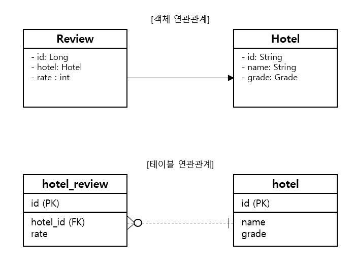

## 엔티티간 N:1 단방향 연관

JPA에서 엔티티간 N:1 연관은 DB 테이블 간 참조키로 구현한다.
아래는 회원과 팀의 관계에 대한 엔티티 클래스, 테이블 예제이다.



이러한 관계를 코드로 구현하면 아래와 같다.

```Java
 
 public class Review {

     @id
     @GeneratedValue(strategy = GenerationType.IDENTITY)
     private long id;

     @ManyToOne
     @JoinColumn(name="hotel_id")
     private Hotel hotel;

     private int rate;
 }
 
```

@ManyToOne 어노테이션은 다수의 Review 엔티티가 하나의 Hotel 엔티티를 참조하는 N:1 연관임을 설정한다.
@JoinColumn 어노테이션은 연관된 객체를 참조할 때 사용할 칼럼 이름을 지정한다.


아래는 Hotel 객체를 구해서 새로운 Review 객체와 연관 관계를 맺는 코드이다.

```Java
    em.getTransaction().begin();

    Hotel hotel = em.find(Hotel.class, "13");
    Review review = new Review(hotel, 5);

    em.persist(review);

    em.getTransaction().commit();
```


#### N:1 연관 엔티티 로딩

@ManyToOne 애노테이션의 fetch 속성은 기본값으로 FetchType.Eager를 사용한다. 앞선 예제로 설명하면 Review 엔티티를 조회하면 연관된 Hotel 엔티티도 함께 로딩한다.


#### JPQL을 활용하여 연관 맺은 엔티티 목록 구하기

JPQL을 활용하여 특정 엔티티와 연관된 엔티티 목록을 구하는 예제를 보자.

```Java

    EntityManager em = EMF.createEntityManager();

    try {
        Hotel hotel = em.find(Hotel.class, "H100-01");

        TypedQuery<Review> query = em.createQuery(
            "select r from Review r where r.hotel = : hotel" + "order by r.id desc", Review.class
        );
        
        query.setParameter("hotel", hotel);
        query.setFirstResult(3);
        query.setMaxResult(3);
        List<Review> reviews = query.getResultList();

        ...
    } finally {
        em.close();
    }

```

JPQL은 sql과 대부분 유사하다. 차이점이 있다면 테이블의 칼럼 값 대신에 엔티티 타입을 사용한다는 것이다.
코드를 실행했을 때 실제 쿼리는 아래와 같다.

```
select r.id, r.hotel_id, r.rate from hotel_review r where r.hotel_id ? order by r.id desc limit ?, ?
binding parameter [1]as [VARCHAR] - [H100-01]
```


</br>
출처

[JPA 프로그래밍 입문](https://www.kame.co.kr/nkm/detail.php?tcode=299&tbook_jong=3)
