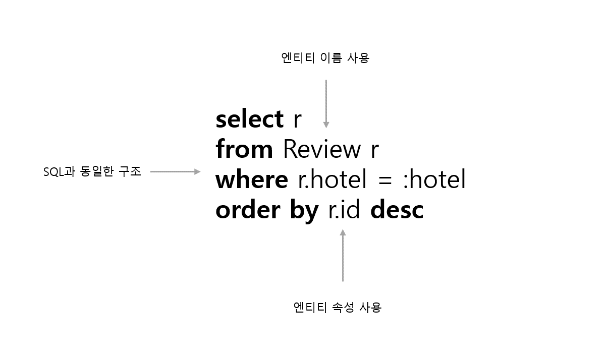
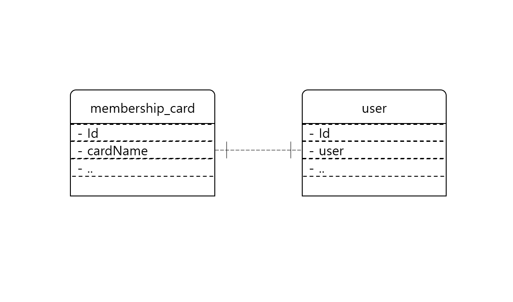

## JPQL

JPQL은 JPA Query Language의 약자로 JPA에서 사용하는 쿼리 언어이다.
SQL과의 차이점은 테이블과 칼럼 이름 대신 엔티티 이름과 속성 이름을 사용한다는 점이다.


아래는 JPQL의 특징을 나타낸 그림이다.


### JPQL 기본 코드
JPQL의 기본 구조는 아래와 같다.

> select 별칭 from 엔티티이름 as 별칭

from 절 뒤의 '엔티티이름'은 @Entity 어노테이션이 적용된 클래스의 이름과 같다.
별칭은 필수이며 as는 생략 가능하다.

JPQL을 실행하려면 EntityManager의 createQuery() 메소드로 Query를 생성해야한다.

Select Query의 결과 타입을 모른다면 createQuery(String) 메소드를 사용하여 Query 클래스를 생성해야하고 Query 클래스는 결과를 Object로 리턴한다.
예는 아래와 같다.

```java
Query q = em.createQuery("select u from User u");
List users = q.getResultList();
for (Object u : users) {
    User user = (User) u;
    ...
}
```

만약 결과가 정확하게 한 개인 경우 getSingleResult() 메서드를 사용할 수 있다. 다만 getSingleResult() 메소드는 결과가 없거나 결과가 두 개 이상인 경우 Exception가 발생하므로 주의가 필요하다.

Select Query의 결과 타입을 알고 있는 경우 createQuery(String, Class) 메소드를 이용하여 TypedQuery 객체를 생성한다.
예를 들어 User 타입의 결과를 리턴하는 select query는 아래와 같이 생성한다.

```java
TypedQuery<User> q = em.createQuery("select u from User u", User.class);
List<User> users = q.getResultList();
```

두 메소드는 리턴 타입 외에는 동일한 기능을 가지므로 리턴 타입을 알면 TypedQuery를 사용하자.

#### 정렬

**order by** 키워드를 사용하면 정렬 순서를 지정할 수 있다.

> select p from Player p order by p.name asc 

두 개 이상의 속성을 사용하여 정렬하고 싶다면 아래와 같이 콤마로 구분하면 된다.

> select p from Player p order by p.id, p.name desc 

#### 조건 설정

**where** 키워드를 사용하여 특정 조건을 충족하는 엔티티를 검색할 수 있다.

> select p from Player p where p.team.id = "T1"

조건 검사를 위해서 파라미터 입력이 필요할 때 아래와 같이 setParameter 메소드를 이용하여 파라미터를 입력할 수 있다.

```Java

TypedQuery<Player> q = em.createQuery("select p from Player p where p.team.id = :teamId", Player.class);
q.setParameter("teamId", "T1");
List<Player> players = q.getResultList();

```

#### 기본 비교 연산자

조건을 검사하는 비교 연산자는 아래와 같다.

| 연산자 | 설명 | 예시 |
|---|:---|:---|
| = | 값이 같은지 비교한다. | u.name = 'JPA'
| <> | 값이 다른지 비교한다. | o.state <> ?
| >, >=, <, <= | 값의 크기를 비교한다. | p.salary > 2000
| between | 값이 사이에 포함되는지 비교한다. | p.salary between 1000 and 2000
| in, not in | 지정한 목록에 값이 존재하는지 또는 존재하지 않는지 확인한다. | o.grade in ('star4', 'star5')
| like, not like | 지정한 문자열을 포함하는지 검사한다. | u.name like '이%'
| is null, is not null | 값이 null인지 null이 아닌지 검사한다. | mc.owner is null


#### 컬렉션 비교 연산자

컬렉션에 대한 비교가 가능하다. 특정 엔티티나 값이 컬렉션에 속해있는지 검사하고 싶으면 **member of** 키워드를 사용한다.
예를 들어 Player와 Team이 1:N 연관을 갖는다고 할 때 특정 Player를 포함하는 Team을 구하기 위해 아래와 같이 쿼리를 작성하면 된다.

```Java
Player p = em.find(Player.class, "P1");
TypedQuery<Team> q = em.createQuery("select t from Team t where :player member of t.players order by t.name", Team.class);
q.setParameter("player", p);
List<Team> teams = q.getResultList();

```

이 코드의 실제 sql은 아래와 같다. 
```sql
select t.id, t.name from Team t where ? in (select p.player_id from Player p where t.id=p.team_id)
order by name;
```

#### 존재 검사

특정 값이 존재하는지 검사하고 싶을 때 **exists**, **all**, **any**를 사용한다.
exists는 서브 쿼리 결과가 존재하는지 검사한다.
all은 서브 쿼리 결과가 조건을 모두 충족하는지 검사한다.
any는 서브 쿼리 결과를 충족하는 대상이 하나라도 있는지 검사한다.

예는 아래와 같다.

```sql
Exists 예제
select h from Hotel h where exists (select r from Review r where r.hotel = h) order by name

All 예제
select t from Team t where 500 < all (select p.salay from Player p where p.team = t)

Any 예제
select t from Team t where 500 < any (select p.salay from Player p where p.team = t)

```

### 페이징 처리

JPA의 Query와 TypedQuery 클래스를 사용하여 페이징 처리를 할 수 있다.
setFirstResult() 메소드는 조회할 첫 번째 결과의 위치를 지정한다.
setMaxResults() 메소드는 조회할 최대 개수를 지정한다.

```java
Query q = em.createQuery("select u from User u");
q.setFirstResult(10);
q.setMaxResults(5);
List users = q.getResultList();
```

위의 JPQL을 실행한 SQL 쿼리(mysql)는 아래와 같다.

```sql
select u.id, ... from user u order limit 10,5

```

### 조인

JPQL에서는 3가지 방식으로 조인을 수행할 수 있다.
- 자동 조인
- 명시적 조인
- where 절에서 조인

자동 조인은 연관된 엔티티의 속성에 접근할 때 자동으로 조인한다.

> select p from Player p where **p.team.name** = :teamName

명시적 조인은 아래와 같이 명시적으로 **join** 키워드를 사용하는 것이다. join 키워드를 사용하면 기본으로 inner join을 사용하여 조인한다. 외부 조인의 경우 **left join**, **right join**을 사용하면 된다.

> select p from Player p **join** p.team t where where t.name = :teamName

where 조인은 **where** 키워드를 사용하여 조인한다. 이 경우 연관된 엔티티가 아니어도 두 엔티티의 속성을 비교해서 조인을 수행할 수 있다.

> select p from Player p, Team t where p.teamId = t.id


### 집합 함수

SQL과 마찬가지로 아래와 같은 집합 함수를 제공한다.


| 함수 | 설명 | 리턴 타입 |
|---|:---|:---|
| count | 개수를 구함 | Long
| max, min | 최대값과 최소값을 구함 | 해당 속성 타입
| avg | 평균을 구함 | Double
| sum | 합을 구함 | 칼럼의 속성에 따라 다름

집합 함수와 함께 쓰이는 것으로 group by를 사용할 수 있다. sql과 마찬가지로 group by에 having을 사용해 조건을 지정할 수도 있다.

```java
TypedQuery<Object> q = em.createQuery("select t, count(p), avg(p.salary) from Team t left join t.players p group by t having count(p) > 1", Object[].class);

List<Object[]> rows = q.getResultList();
for(Object[] val : rows) {
    Team Team = (Team) val[0];
    Long count = (Long) val[1];
    Double avgSal = (Double) val[2];
}

```

### 다양한 함수들

문자열과 수치 연산을 위한 기본 함수를 제공한다. 이들 함수는 select, where, having 절에서 사용할 수 있다.

</br>

#### 문자열 함수

| 함수 | 설명 |
|---|:---|
| CONCAT | 두 문자열을 연결함
| SUBSTRING | 문자열의 시작 위치부터 지정한 길이까지 부분 문자열을 구한다.
| TRIM | 문자열의 공백을 제거한다.
| LOWER | 소문자로 변환
| UPPER | 대문자로 변환
| LENGTH | 길이를 구한다.
| LOCATE | 문자열에서 특정 문자열이 포함된 위치를 구한다.

</br>

#### 수학 함수

| 함수 | 설명 |
|---|:---|
| ABS | 절대값을 구한다.
| SQRT | 제곱근을 구한다.
| MOD | 나머지를 구한다.

</br>

#### 날짜 시간 함수

| 함수 | 설명 |
|---|:---|
| CURRENT_DATE | 현재 시간을 SQL DATE 타입으로 구한다.
| CURRENT_TIME | 현재 시간을 SQL TIME 타입으로 구한다.
| CURRENT_TIMESTAMP | 현재 시간을 SQL TIMESTAMP 타입으로 구한다.

</br>

#### 컬렉션 함수

| 함수 | 설명 |
|---|:---|
| SIZE | 컬렉션의 사이즈를 구한다.
| INDEX | 컬렉션의 인덱스 값을 비교할 때 사용한다.
 

### Named 쿼리

쿼리는 소스 코드에 직접 넣게 되면 따옴표, + 연산자 등으로 코드가 복잡해진다. 이를 해결하기위해 xml에 쿼리를 등록하거나 
어노테이션으로 등록하는 방법이 있다. 여기서는 어노테이션으로 등록하는 방법을 설명한다.

@NamedQuery 어노테이션을 통해 쿼리를 등록할 수 있다. @NamedQuery 어노테이션은 Entity 클래스만 등록할 수 있다.

```java
@Entity
@NamedQueries({}
    @NamedQuery(name="Hotel.all", query = "select h from Hotel h"),
    @NamedQuery(name="Hotel.findById", query = "select h from Hotel h where h.id = :id")
})
public class Hotel{
    @id
    private String id;
    ...
}
```

@NamedQuery를 이용하여 등록한 쿼리 사용 방법은 아래와 같다.

```java
TypedQuery<Hotel> q = em.createNamedQuery("Hotel.all", Hotel.class);
List<Hotel> hotels = q.getResultList();
```

### 1:1, N:1 연관과 fetch 조인

1:1 연관 관계의 두 엔티티에 대하여 fetch 속성을 Eager로 설정하면, 하나의 엔티티를 조회 query를 실행하고 연관된 엔티티를 위한 query도 실행하게 된다.



이렇게 연관 관계의 엔티티를 호출할 때 다수의 쿼리가 발생하는 문제를 N+1 쿼리 문제라고 한다. 이 문제를 해결하기 위한 가장 쉬운 방법은
JPQL에서 **fetch** 키워드로 조인을 사용하는 것이다.

fetch 조인을 사용한 예는 아래와 같다.

```java
TypedQuery<MembershipCard> q = em.createQuery(
    "select mc from MembershipCard mc left join fetch mc.owner u", MembershipCard.class);
List<MembershipCard> hotels = q.getResultList();
```

join 뒤에 fetch 키워드를 사용하면 JPA는 조인한 대상을 함께 로딩해서 생성한다. 즉, getResultList() 메서드를 실행하는 시점에 조인 쿼리를 실행하여 한번에 MembershipCard와 User 엔티티를 함께 로딩한다.

```sql
select
    mc.id, mc.cardName, mc.user_id, u.id, u.name 
from
    membership_card mc left outer join user u on mc.user_id=u.id
```

fetch 키워드는 엔티티 연관 설정이 Lazy인 경우에도 적용된다.

</br>
출처

[JPA 프로그래밍 입문](https://www.kame.co.kr/nkm/detail.php?tcode=299&tbook_jong=3)
